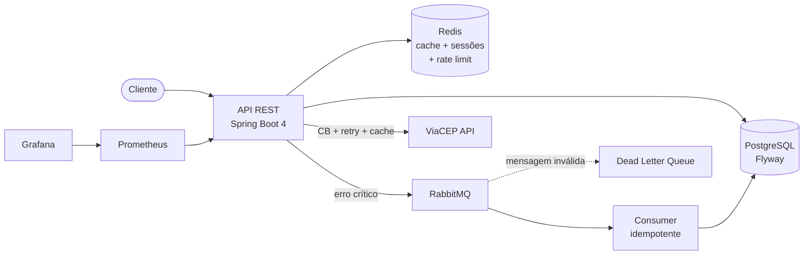

# Advanced CRUD

[](https://github.com/caiquediasp/Advanced-Crud/actions/workflows/ci.yml)
[](https://sonarcloud.io/summary/new_code?id=caiquediasp_Advanced-Crud)
[](https://sonarcloud.io/summary/new_code?id=caiquediasp_Advanced-Crud)

API REST de gerenciamento de usuários e endereços construída com **Java 21** e **Spring Boot 4**, com foco em segurança, resiliência e qualidade de código.

<!-- Quando fizer o deploy, descomente e ajuste a URL:
> **Demo ao vivo:** [Swagger UI](https://SUA-URL-AQUI/swagger-ui.html)
-->

## Destaques

- **Autenticação JWT (RS256)** com rotação de refresh tokens e **detecção de reuso** — se um token rotacionado é usado de novo, toda a família de sessões é revogada atomicamente (script Lua no Redis)
- **Rate limiting** por e-mail e por IP contra força bruta no login
- **Pipeline assíncrono de erros críticos** com RabbitMQ: erro 500 → evento publicado → consumer idempotente persiste no banco; mensagens inválidas vão para a **dead letter queue**
- **Integração resiliente** com a API ViaCEP: circuit breaker, retry com backoff exponencial e cache no Redis (Resilience4j)
- **43 testes** unitários e de integração com **Testcontainers** (PostgreSQL, Redis e RabbitMQ reais) — 78% de cobertura
- **Quality gate limpo** no SonarCloud, CI com GitHub Actions a cada push
- **Observabilidade** com Actuator, Prometheus e Grafana

## Arquitetura



## Stack

| Categoria | Tecnologias |
|---|---|
| Core | Java 21, Spring Boot 4, Spring Security (OAuth2 Resource Server), Spring Data JPA |
| Dados | PostgreSQL, Flyway, Redis |
| Mensageria | RabbitMQ (DLQ, retry, consumer idempotente) |
| Resiliência | Resilience4j (circuit breaker, retry, cache) |
| Testes | JUnit 5, Mockito, Testcontainers, Awaitility, JaCoCo |
| Qualidade & CI | SonarQube / SonarCloud, GitHub Actions |
| Observabilidade | Actuator, Micrometer, Prometheus, Grafana |
| Outros | MapStruct, Lombok, springdoc-openapi (Swagger) |

## Endpoints

| Método | Rota | Descrição |
|---|---|---|
| `POST` | `/api/v1/auth/register` | Cadastro de usuário |
| `POST` | `/api/v1/auth/login` | Login (retorna access + refresh token) |
| `POST` | `/api/v1/auth/refresh` | Rotação do refresh token |
| `GET/PUT` | `/api/v1/users/me` | Perfil do usuário autenticado |
| `PATCH` | `/api/v1/users/me/password` | Troca de senha |
| `DELETE` | `/api/v1/users/me` | Exclusão da conta (soft delete) |
| `POST` | `/api/v1/users/me/logout-all` | Revoga todas as sessões |
| `GET/POST/PUT/DELETE` | `/api/v1/addresses` | CRUD de endereços |
| `PATCH` | `/api/v1/addresses/{id}/primary` | Define endereço principal |
| `GET` | `/api/v1/addresses/lookup/{cep}` | Consulta CEP via ViaCEP |
| `GET/PATCH` | `/api/v1/admin/users/**` | Gestão de usuários (role ADMIN) |

Documentação completa e interativa no Swagger: `http://localhost:8080/swagger-ui.html`

### Exemplo rápido

```bash
# Cadastro
curl -X POST http://localhost:8080/api/v1/auth/register \
  -H "Content-Type: application/json" \
  -d '{"name": "Caique", "email": "caique@email.com", "password": "SenhaForte@123"}'

# Login
curl -X POST http://localhost:8080/api/v1/auth/login \
  -H "Content-Type: application/json" \
  -d '{"email": "caique@email.com", "password": "SenhaForte@123"}'
```

Resposta do login:

```json
{
  "accessToken": "eyJhbGciOiJSUzI1NiIs...",
  "refreshToken": "d290f1ee-6c54-4b01-90e6-d701748f0851",
  "tokenType": "Bearer",
  "expiresIn": 900
}
```

Use o `accessToken` no header das rotas protegidas: `Authorization: Bearer <token>`.

## Como rodar

Pré-requisitos: **Docker** e **Docker Compose**.

**1. Gere o par de chaves RSA** usado para assinar os JWTs (não versionado por segurança):

```bash
openssl genpkey -algorithm RSA -pkeyopt rsa_keygen_bits:2048 -out src/main/resources/keys/private.pem
openssl rsa -in src/main/resources/keys/private.pem -pubout -out src/main/resources/keys/public.pem
```

**2. Suba tudo com o Compose** (app + PostgreSQL + Redis + RabbitMQ + Prometheus + Grafana):

```bash
docker compose up --build
```

A API sobe em `http://localhost:8080` com as migrations do Flyway aplicadas automaticamente.

| Serviço | URL |
|---|---|
| Swagger UI | http://localhost:8080/swagger-ui.html |
| Actuator (health, metrics) | http://localhost:8081/actuator/health |
| RabbitMQ Management | http://localhost:15672 |
| Prometheus | http://localhost:9090 |
| Grafana | http://localhost:3000 |

## Testes

Os testes de integração usam **Testcontainers** — PostgreSQL, Redis e RabbitMQ reais sobem em containers descartáveis, então o Docker precisa estar rodando:

```bash
./mvnw verify
```

O relatório de cobertura do JaCoCo fica em `target/site/jacoco/index.html`.

## Decisões de design

- **RS256 em vez de HS256**: chave privada assina, pública valida — permite que outros serviços validem tokens sem compartilhar segredo.
- **Refresh token com família de sessões**: cada login cria uma família; reuso de um token já rotacionado marca a família como comprometida via script Lua (operação atômica no Redis, sem race condition).
- **Consumer idempotente**: RabbitMQ garante entrega *at-least-once*, então o consumer checa o `eventId` antes de persistir — mensagem duplicada não gera linha duplicada.
- **`default-requeue-rejected=false`**: mensagem que falha na desserialização vai direto para a DLQ em vez de reentrar na fila em loop infinito.
- **Circuit breaker ignora `CepNotFoundException`**: CEP inexistente é resposta válida do ViaCEP, não falha de infraestrutura — não deve abrir o circuito nem disparar retry.

## Créditos

Projeto inspirado no [person-crud](https://github.com/KozielGPC/person-crud), reimplementado do zero em Java/Spring com escopo expandido.

## Licença

Este projeto está sob a licença descrita em [LICENSE](LICENSE).
