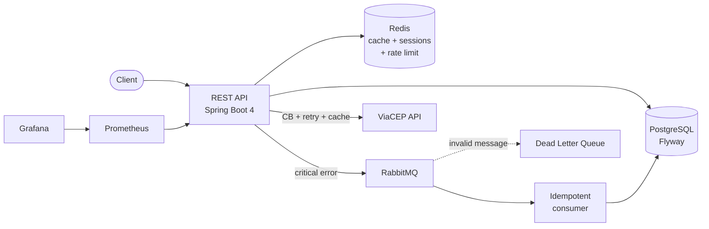

# Advanced CRUD

**English** | [Português](README.pt-BR.md)

[](https://github.com/caiquediasp/Advanced-Crud/actions/workflows/ci.yml)
[](https://sonarcloud.io/summary/new_code?id=caiquediasp_Advanced-Crud)
[](https://sonarcloud.io/summary/new_code?id=caiquediasp_Advanced-Crud)

REST API for user and address management built with **Java 21** and **Spring Boot 4**, focused on security, resilience, and code quality.

<!-- When deployed, uncomment and set the URL:
> **Live demo:** [Swagger UI](https://YOUR-URL-HERE/swagger-ui.html)
-->

## Highlights

- **JWT authentication (RS256)** with refresh token rotation and **reuse detection** — if a rotated token is used again, the whole session family is revoked atomically (Lua script on Redis)
- **Rate limiting** by e-mail and by IP against login brute force
- **Asynchronous critical-error pipeline** with RabbitMQ: 500 error → event published → idempotent consumer persists it to the database; invalid messages go to the **dead letter queue**
- **Resilient integration** with the ViaCEP API: circuit breaker, retry with exponential backoff, and Redis cache (Resilience4j)
- **43 unit and integration tests** with **Testcontainers** (real PostgreSQL, Redis, and RabbitMQ) — 78% coverage
- **Clean quality gate** on SonarCloud, CI with GitHub Actions on every push
- **Observability** with Actuator, Prometheus, and Grafana

## Architecture



## Stack

| Category | Technologies |
|---|---|
| Core | Java 21, Spring Boot 4, Spring Security (OAuth2 Resource Server), Spring Data JPA |
| Data | PostgreSQL, Flyway, Redis |
| Messaging | RabbitMQ (DLQ, retry, idempotent consumer) |
| Resilience | Resilience4j (circuit breaker, retry, cache) |
| Testing | JUnit 5, Mockito, Testcontainers, Awaitility, JaCoCo |
| Quality & CI | SonarQube / SonarCloud, GitHub Actions |
| Observability | Actuator, Micrometer, Prometheus, Grafana |
| Other | MapStruct, Lombok, springdoc-openapi (Swagger) |

## Endpoints

| Method | Route | Description |
|---|---|---|
| `POST` | `/api/v1/auth/register` | User registration |
| `POST` | `/api/v1/auth/login` | Login (returns access + refresh token) |
| `POST` | `/api/v1/auth/refresh` | Refresh token rotation |
| `GET/PUT` | `/api/v1/users/me` | Authenticated user profile |
| `PATCH` | `/api/v1/users/me/password` | Password change |
| `DELETE` | `/api/v1/users/me` | Account deletion (soft delete) |
| `POST` | `/api/v1/users/me/logout-all` | Revokes all sessions |
| `GET/POST/PUT/DELETE` | `/api/v1/addresses` | Address CRUD |
| `PATCH` | `/api/v1/addresses/{id}/primary` | Sets the primary address |
| `GET` | `/api/v1/addresses/lookup/{cep}` | CEP (zip code) lookup via ViaCEP |
| `GET/PATCH` | `/api/v1/admin/users/**` | User management (ADMIN role) |

Full interactive documentation on Swagger: `http://localhost:8080/swagger-ui.html`

### Quick example

```bash
# Register
curl -X POST http://localhost:8080/api/v1/auth/register \
  -H "Content-Type: application/json" \
  -d '{"name": "Caique", "email": "caique@email.com", "password": "StrongPass@123"}'

# Login
curl -X POST http://localhost:8080/api/v1/auth/login \
  -H "Content-Type: application/json" \
  -d '{"email": "caique@email.com", "password": "StrongPass@123"}'
```

Login response:

```json
{
  "accessToken": "eyJhbGciOiJSUzI1NiIs...",
  "refreshToken": "d290f1ee-6c54-4b01-90e6-d701748f0851",
  "tokenType": "Bearer",
  "expiresIn": 900
}
```

Use the `accessToken` in the header of protected routes: `Authorization: Bearer <token>`.

## How to run

Prerequisites: **Docker** and **Docker Compose**.

**1. Generate the RSA key pair** used to sign the JWTs (not versioned for security reasons):

```bash
openssl genpkey -algorithm RSA -pkeyopt rsa_keygen_bits:2048 -out src/main/resources/keys/private.pem
openssl rsa -in src/main/resources/keys/private.pem -pubout -out src/main/resources/keys/public.pem
```

**2. Bring everything up with Compose** (app + PostgreSQL + Redis + RabbitMQ + Prometheus + Grafana):

```bash
docker compose up --build
```

The API starts at `http://localhost:8080` with Flyway migrations applied automatically.

| Service | URL |
|---|---|
| Swagger UI | http://localhost:8080/swagger-ui.html |
| Actuator (health, metrics) | http://localhost:8081/actuator/health |
| RabbitMQ Management | http://localhost:15672 |
| Prometheus | http://localhost:9090 |
| Grafana | http://localhost:3000 |

## Tests

The integration tests use **Testcontainers** — real PostgreSQL, Redis, and RabbitMQ instances spin up in disposable containers, so Docker must be running:

```bash
./mvnw verify
```

The JaCoCo coverage report is generated at `target/site/jacoco/index.html`.

## Design decisions

- **RS256 instead of HS256**: the private key signs, the public key verifies — other services can validate tokens without sharing a secret.
- **Refresh tokens with session families**: each login creates a family; reusing an already-rotated token marks the family as compromised via a Lua script (atomic operation on Redis, no race condition).
- **Idempotent consumer**: RabbitMQ guarantees *at-least-once* delivery, so the consumer checks the `eventId` before persisting — a duplicate message never creates a duplicate row.
- **`default-requeue-rejected=false`**: a message that fails deserialization goes straight to the DLQ instead of re-entering the queue in an infinite loop.
- **Circuit breaker ignores `CepNotFoundException`**: a nonexistent CEP is a valid ViaCEP response, not an infrastructure failure — it should neither open the circuit nor trigger a retry.

## Credits

Project inspired by [person-crud](https://github.com/KozielGPC/person-crud), reimplemented from scratch in Java/Spring with an expanded scope.

## License

This project is under the license described in [LICENSE](LICENSE).
